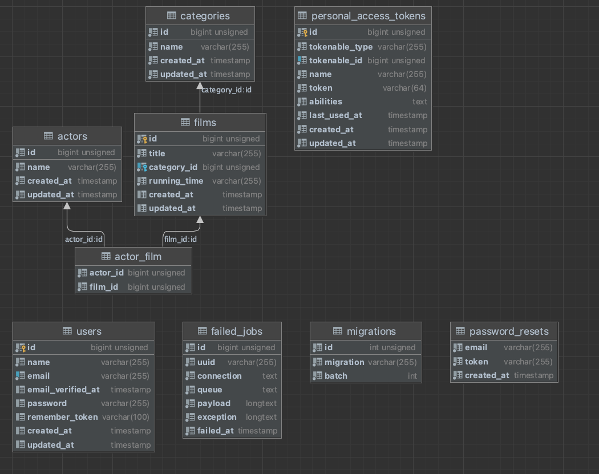
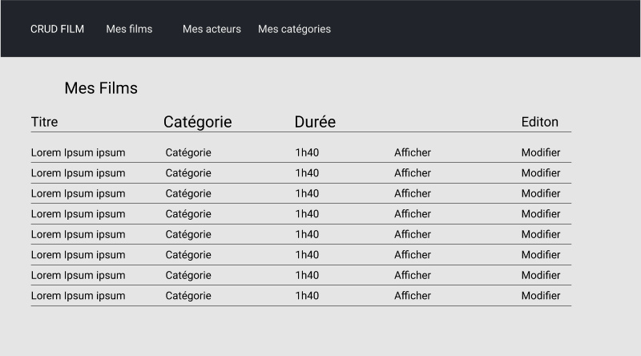
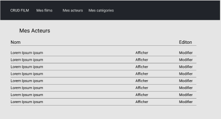
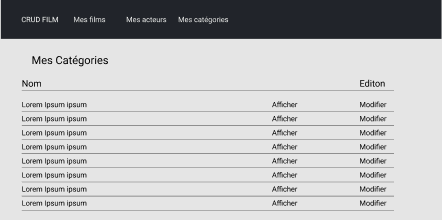

#Crud Film

Ce projet a pour but de gérer une biblothèque de films

Chaque film possède : 

- un titre
- une catégorie
- une durée
- un synopsis

Un film peut être lié à une et une seul catégorie.

Une catégorie peut être donnée à plusieurs films.

Le CRUD permet aussi de gérer les acteurs. Les acteurs peuvent être reliés à un ou plusieurs films.

La base de données s'organise comme suit : 

Ci dessous l'organisation les wireframes : 

Les différentes commandes pour installer le site :

L'adresse du git public : https://github.com/Astonark/films

Cloner le dépot en locale 

Installation des dépendances : 

- composer install
- npm install

Pour installer la base de données : 

-php artisan migrate --seed
